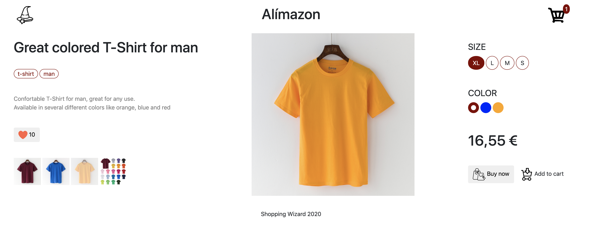
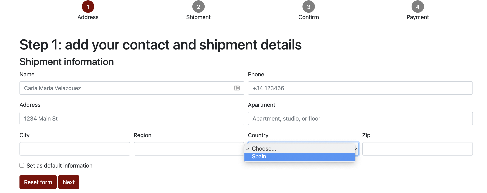
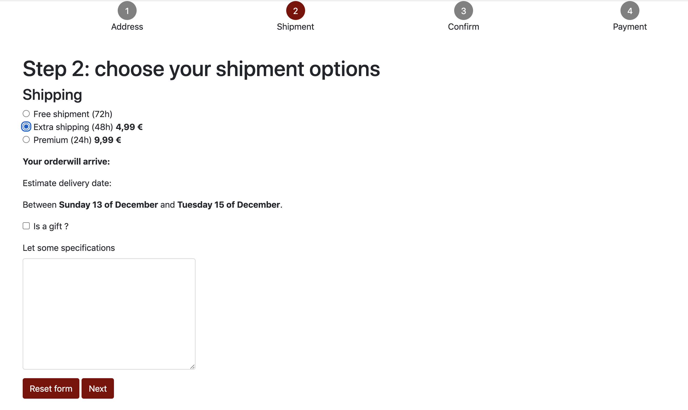
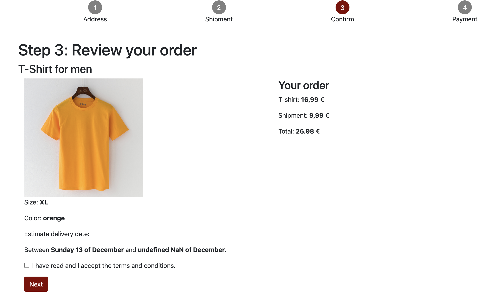

<!--
*** Thanks for checking out this README Template. If you have a suggestion that would
*** make this better, please fork the shopping-wizard and create a pull request or simply open
*** an issue with the tag "enhancement".
*** Thanks again! Now go create something AMAZING! :D
***
***
***
*** To avoid retyping too much info. Do a search and replace for the following:
*** victorgreco, shopping-wizard, twitter_handle, email
-->

<!-- PROJECT SHIELDS -->
<!--
*** I'm using markdown "reference style" links for readability.
*** Reference links are enclosed in brackets [ ] instead of parentheses ( ).
*** See the bottom of this document for the declaration of the reference variables
*** for contributors-url, forks-url, etc. This is an optional, concise syntax you may use.
*** https://www.markdownguide.org/basic-syntax/#reference-style-links
-->
[![Contributors][contributors-shield]][contributors-url]
[![Forks][forks-shield]][forks-url]
[![Stargazers][stars-shield]][stars-url]
[![Issues][issues-shield]][issues-url]
[![MIT License][license-shield]][license-url]
[![LinkedIn][linkedin-shield]][linkedin-url]

<!-- PROJECT LOGO -->
 

  

  <h3 align="center">Shopping Wizard (WIP)</h3>

  

    Guide your customer throw an easy and comfortable buying process !
     
    <a href="https://github.com/victorgreco/shopping-wizard"><strong>Explore the docs »</strong></a>
     
     
    <a href="https://github.com/victorgreco/shopping-wizard">View Demo</a>
    ·
    <a href="https://github.com/victorgreco/shopping-wizard/issues">Report Bug</a>
    ·
    <a href="https://github.com/victorgreco/shopping-wizard/issues">Request Feature</a>
  

<!-- TABLE OF CONTENTS -->
## Table of Contents

* [About the Project](#about-the-project)
* [Built With](#built-with)
* [Roadmap](#roadmap)
* [Contributing](#contributing)
* [License](#license)
* [Contact](#contact)

<!-- ABOUT THE PROJECT -->
## About The Project

### Product page
    

The customer will find all the product information: **Name**, **Description**, **Categories**, **Likes**, **Previews**, **Price**.

The customer will also be able to choose **Size** and **Color** which fits better for them.
Size options updates also the pricing.

Once the customer is ready to buy the product they can **add the product to chart** or directly **buy the product**.

In case they choose the buy directly option they will go to the **next step** on the **buying process**.

### Step 1 - Address & contact Information

During the first step of the buying process we require the address and contact information to the user.

We use form validation in order to check if the filled information is correct or not.

### Step 2 - Shipment Options

The user can choose from 3 different shipment options:
* **Free** (72h)
* **Extra** (48h)
* **Premium** (24h)

The price and the time estimation changes depending on the shipment option.

### Step 3 - Confirm Order

On this view the customer can confirm the product information and pricing before going to the payment step. 

### Step 4 - Payment

The user could choose between PayPal and Credit Card as a payment method.   

### Built With

* [HTML]()
* [CSS]()
* [JavaScript]()
* [Bootstrap]()
* [jQuery]()

<!-- ROADMAP -->
## Roadmap

See the [open issues](https://github.com/victorgreco/shopping-wizard/issues) for a list of proposed features (and known issues).

<!-- CONTRIBUTING -->
## Contributing

Contributions are what make the open source community such an amazing place to be learn, inspire, and create. Any contributions you make are **greatly appreciated**.

1. Fork the Project
2. Create your Feature Branch (`git checkout -b feature/AmazingFeature`)
3. Commit your Changes (`git commit -m 'Add some AmazingFeature'`)
4. Push to the Branch (`git push origin feature/AmazingFeature`)
5. Open a Pull Request

<!-- LICENSE -->
## License

Distributed under the MIT License. See `LICENSE` for more information.

<!-- CONTACT -->
## Contact

Victor Greco - [linkedin](https://www.linkedin.com/in/victor-greco/) - victorgreco263@gmail.com

Project Link: [https://github.com/victorgreco/shopping-wizard](https://github.com/victorgreco/shopping-wizard)

<!-- MARKDOWN LINKS & IMAGES -->
<!-- https://www.markdownguide.org/basic-syntax/#reference-style-links -->
[contributors-shield]: https://img.shields.io/github/contributors/victorgreco/shopping-wizard.svg?style=flat-square
[contributors-url]: https://github.com/victorgreco/shopping-wizard/graphs/contributors
[forks-shield]: https://img.shields.io/github/forks/victorgreco/shopping-wizard.svg?style=flat-square
[forks-url]: https://github.com/victorgreco/shopping-wizard/network/members
[stars-shield]: https://img.shields.io/github/stars/victorgreco/shopping-wizard.svg?style=flat-square
[stars-url]: https://github.com/victorgreco/shopping-wizard/stargazers
[issues-shield]: https://img.shields.io/github/issues/victorgreco/shopping-wizard.svg?style=flat-square
[issues-url]: https://github.com/victorgreco/shopping-wizard/issues
[license-shield]: https://img.shields.io/github/license/victorgreco/shopping-wizard.svg?style=flat-square
[license-url]: https://github.com/victorgreco/shopping-wizard/blob/master/LICENSE.txt
[linkedin-shield]: https://img.shields.io/badge/-LinkedIn-black.svg?style=flat-square&logo=linkedin&colorB=555
[linkedin-url]: https://www.linkedin.com/in/victor-greco/
[product-screenshot]: images/screenshot.png
